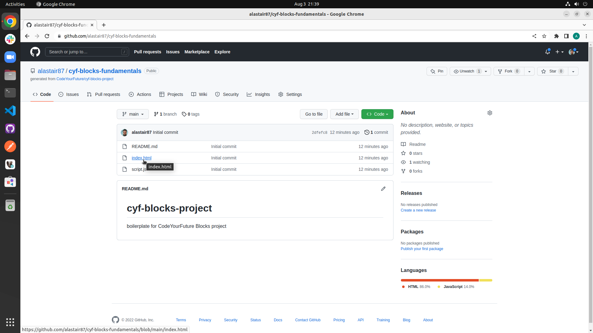

# CYF Blocks Project Template

## Introduction

This is a very basic template for a CYF Blocks project so that you can post it on Netlify as part of the "Ship It!" portion of the CodeYourFuture Fundamentals course.

With it you will take a project you created on CYF Blocks, convert it into a simple static HTML web page stored on GitHub and then publish that web page online using Netlify.

### Why do I need this?

CYF Blocks creates most of the HTML and JavaScript code needed for your project to run in the browser. However it's missing certain infrastructure or 'boilerplate' code that is needed for a standalone web page.

Using this template you will be able to adapt your CYF Blocks project's code so that it can be displayed as a standalone web page, either from your computer or on the Internet.

### Requirements

You do not need any special software on your computer or device to use this repository. All you need is a web browser, a CYF Blocks project you want to deploy and GitHub and Netlify accounts.

***Important: You *must* use the same browser and computer as you used to create your CYF Blocks project as your work is saved locally to that machine.***

## How to use

This GitHub repository is what's known as a template repository. It's a special type of repository ('repo') which you can use to create your own repo with the same basic structure but that can then be modified to suit your needs.

It is a good idea to have two browser windows or browser tabs open, one for GitHub and one for CYF Blocks, as you'll be copying and pasting bits of code from CYF Blocks into GitHub. You definitely don't want to be opening and closing the pages every time as you'll get lost and have to find things again!! You might aLso want to keep these instructions open in a third so you can refer back to them easily.
### Create your own repo

First you'll need to create your own repo on GitHub, based on this template.

The steps to do this are as follows:

1. Sign into your GitHub account on www.github.com if you are not already signed in (if for some reason you don't yet have a GitHub account consult the syllabus at https://codeyourfuture.io/syllabus/fundamentals/preparations) .
2. Go to https://github.com/CodeYourFuture/cyf-blocks-project.
3. In the top right-hand corner you should see a green button called 'Use this template'. Click it.

4. You will see a page like the one below. There is an `Owner` field which should show the same name as your GitHub account. If it says 'Select an owner' click it and then in the dropdown that appears select your GitHub user name.

5. Select the Public option so that other people can see your repo. Enter a name for your repo - 'cyf-blocks-project-fundamentals'. If you want you can put more in the description. Please stick to that name as it helps us if we need to look at your repo and review your work.
6. Click the 'Create repository from template' button.

***Note: Most of the time when we are coding at CodeYourFuture we will be using a tool called VS Code to write our code. However as not everyone can install that at this stage and we haven't covered how to work on your repo in it yet we will edit the code in GitHub directly.***

#### Repo contents

The repo contains two files that you will be editing in order to incorporate your CYF Blocks project and create something you can ship to Netlify. You do not need to touch any other files in the repository as those are for the CYF documentation. This is just for information - we will come back to edit these once we have opened CYF.
##### 'index.html'

The `index.html` is the HTML file that will be served as the main page of your project. This is where you will need to put the 'Static HTML' code from your CYF Blocks project.

##### 'script.js'

The `script.js` file contains the JavaScript code that will be invoked by your `index.html` file. This is where you will need to put the 'Generated Code' from your CYF Blocks project.

### CYF Blocks

1. In a separate browser window or tab navigate to https://blocks.codeyourfuture.io.
2. To select the project you want to use, click the the three lines in the top right-hand corner (this symbol is sometimes referred to as a 'hamburger' icon) to access the CYF Blocks menu.
3. Select the Activity or Project that you want to ship to Netlify.
4. Hopefully once you have done this you will see a completed CYF Blocks activity similar to below (it will be different depending on which one you chose). If not you may still need to do the activity or select another activity that you have done. If you are stuck you can ask a volunteer to help you.

5. Click in the white text area under `Static HTML`. To make sure you select all of the text press the Ctrl-A key combination on PC/ChromeBook or Cmd-A key combination on Mac (doing it this way instead of clicking and dragging helps avoid missing anything out which could be very frustrating as it may not be obvious when trying to debug it later!!). Then right-click on it and select 'Copy' as you usually would.
6. Go back to the browser window or tab where you have GitHub open and click on `index.html` in the list of files in the repo.

7. In the next page that appears you can see the contents of the `index.html` file. Towards the right-hand corner just above that there is a small pencil icon - click it and you will be taken to an editor where you can edit the file.